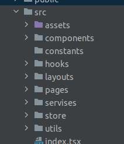
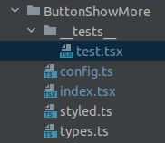

# Tестовое задание приложение Youtube

## Техническое задание

[Техническое задание](https://github.com/foxnorth228/movies-searcher/blob/master/README_youtube.md)

## API:

Используемое API:

[IMDB API](https://imdb-api.com/) - официальное API для работы с IMDB   
Предложенные в ТЗ API не подошли по требованиям. IMDb Top 100 Movies перенесли получения трейлера в отдельный запрос, 
а количество запросов крайне ограничего. Долго искал подходящую API, пришлось брать эту. 
Для того, чтобы запросы работали, требуется .env файл, отправил отдельно от проекта. API Key будет актуален до 2 октября. 

## Особенности

### Кеширование

Кеширование на запросы посика по названию и жанру кешируются с помощью встроенного функционала Redux Toolkit Query.
Для кеширования данных от id запросов данные сохраняются в redux moviesSlice. В нём хранится объект,
который в качестве ключа использует id, в качестве значение - полученные от API данные.
Перед каждым id запросом идёт проверка, или данный id уже есть в moviesSlice

### Файловая структура



- ***hooks*** - папка с пользовательскими хуками

- ***layouts*** - папка с крупными логическими блоками. Не такие независимые элементы, как pages, но крупнее, чем обычный components, и имеющие общую цель и логику

- ***services*** - папка для работы с API

- В папках components и layouts также хранятся __tests__, которые являются jest unit-tests

### Деплой

[Деплой на Netlify](https://master--cosmic-melba-e0d448.netlify.app/)

```yarn install``` - команда установки зависимостей

```yarn run build``` - команда сборки проекта в папку public

```yarn run dev``` - команда для запуска dev сервера

```yarn run lint``` - команда для проверки синтаксиса (eslint)

```yarn run lint:fix``` - команда для проверкии исправления синтаксиса (eslint)

```yarn run test``` - команда для запуска unit-тестов(jest)

```yarn run test:cov``` - команда для запуска unit-тестов(jest) и просмотра покрытия

```yarn run cypress:open``` - команда для запуска e2e тестов(удостоверьтесь, что dev-сервер в этот момент запущен)

## Дополнительные используемые технологии

- ***msw*** - пакет, позволяющий создать тестовый сервер для симуляции получения данных по запросам с сервева, используется во время unit-тестов
- Несколько webpack плагинов для упрощения сборки и оптимизации кода

## Рефакторинг

После долгих размышлений было решено в именовании переменных придерживаться адаптированного BEM стиля: BlockName__ElemName_modName_modVal

- Названия компонентов и их папок: PascalCase
- Название файлов: camelCase
- Классовые компонениы styled - BEM React
- Остальные переменные: camelCase
- Интерфейсы всегда начинаются с заглавной I, PascalCase
- Типы начинаются с заглавной T, PascalCase

### Файловая структура компонента



- __tests__ - папка с тестами и нужными им файлами
- test - файл с unit-тестами
- config - файл со статическими данными компонента
- index - основной файл компонента
- styled - файл со styled-components данного компонента
- types - файл, хранящий пользовательские типы данных

### Дополнение

Всё делал по описанным требованиям, реализовал elastic search с debounce. Из-за того,
используются запросы на апи, elastic search будет работать немного медленно. Перенёс стили в
ThemeProvider. Рефакторить код тоже старался согласно требованиям, но к воскресенью 
я уже немного устал и глаз замылился, мог что-то пропустить или упустить
